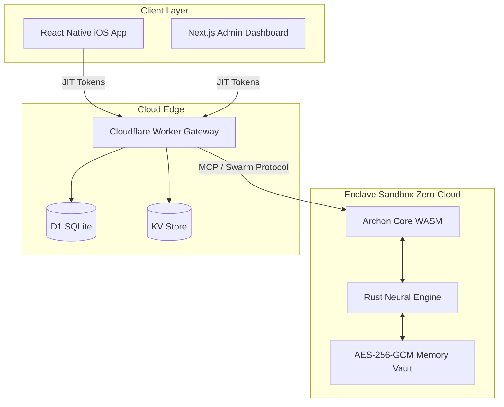

# Archon: Autonomous AI Life Twin

[](http://localhost:3000)
[](http://localhost:8787)

> **Archon is not a passive dashboard. It is an autonomous, on-device AI digital twin.** <br/>
> It acts on your behalf—canceling unused subscriptions, claiming flight delays, and managing your smart home—while keeping your private data strictly within a military-grade WebAssembly (WASM) enclave on your device. Zero cloud exposure.

---

## 🛑 The Problem: The Privacy Paradox in AI

Current digital assistants and financial trackers face two fatal flaws:
1. **Tracker Apps are Reactive:** Traditional apps (like Mint or Apple Health) require the user to manually input data and interpret charts. If a user is paying $80/mo for a gym they don't visit, the app simply shows a red line graph. The user still has to do the labor of canceling the membership.
2. **Cloud AI is a Privacy Nightmare:** LLMs (like ChatGPT or Claude) can give proactive advice, but doing so requires the user to hand over their raw banking credentials, medical records, and private emails to a centralized cloud server. This is a catastrophic security risk.

## 💡 The Solution: Zero-Cloud Intelligence

**Archon** bridges this gap. It provides the proactive intelligence of an LLM without the privacy risks of the cloud. 
Instead of sending your data to the AI, **Archon brings the AI to your data.** 

Archon runs a proprietary neural engine written in Rust (`archon-core`), compiled to WebAssembly (WASM). This engine executes *directly on your smartphone or laptop*. Your sensitive emails, bank transactions, and health data never leave your device in plaintext.

---

## 🎯 Core Use Cases

Archon operates across 6 primary "Hubs" in your life. When Archon detects an inefficiency or a problem, it generates an **Intent** (a proposed action). You simply tap "Approve", and Archon executes the API calls on your behalf.

### 1. 💰 Financial Optimization (DeFi & TradFi)
*   **The Scenario:** You haven't used your Netflix subscription in 3 months.
*   **The Archon Action:** Archon detects the unused expense via Plaid, finds the cancellation URL, drafts the cancellation request, and prompts you for 1-tap approval to cancel it.

### 2. ✈️ Travel & Logistics
*   **The Scenario:** Your American Airlines flight is delayed by 4 hours.
*   **The Archon Action:** Archon reads the delay email via Gmail IMAP. Knowing aviation compensation laws (e.g., EU261 or US DOT regulations), it instantly drafts an email to the airline demanding a $300 refund, waiting only for your final approval to send.

### 3. 🧬 Health & Longevity
*   **The Scenario:** Your Oura ring detects a 15% drop in Heart Rate Variability (HRV) over 4 days.
*   **The Archon Action:** Archon cross-references your calendar, notices a high-stress meeting tomorrow, and proactively attempts to reschedule it or adjusts your smart home thermostat to a cooler temperature to improve your sleep quality.

---

## 🧠 System Architecture

Archon is built on a bleeding-edge stack utilizing edge computing and local execution:



### Key Technical Achievements
1. **On-Device WASM Enclave (`archon-core`)**: The AI intent logic is written in Rust and compiled to WebAssembly. It executes directly on the client device. 
2. **Cryptographic Identity (`ed25519`)**: Every Archon instance generates a secure hardware-backed identity. Local data is scrubbed from RAM using `zeroize` and stored at rest using AES-256-GCM encryption.
3. **Cloudflare D1 Persistence**: The Gateway edge API relies on distributed SQLite (D1) for hyper-fast, globally replicated state management.
4. **Premium Encrypted UX**: A completely overhauled Next.js Web Dashboard featuring deep glassmorphism, Recharts visualization, and real-time optimistic UI updates.

---

## 🔒 Evaluation & Sandbox Mode

Because Archon requires deep integration with highly sensitive user APIs (Plaid, Apple HealthKit, Google Workspace), this deployment is currently running in **Sandbox Evaluation Mode**. 

To allow evaluators to experience the autonomous intent engine without requiring them to supply real banking credentials or OAuth tokens, the Cloudflare Gateway deterministically simulates real-world data streams. 

**What is real?** 
The core intelligence (`archon-core`), the cryptography, the AES memory vault, and the self-healing `ANNEAL` agent logic are 100% active and running locally. The Gateway simply feeds this engine simulated API responses to safely demonstrate the UX.

---

## 🚀 Running the Local Demo

For engineers and evaluators who wish to run the entire Archon ecosystem locally:

### 1. Prerequisites
- Node.js 18+
- pnpm (`npm install -g pnpm`)
- Rust (`rustup default stable`)
- wrangler (`npm install -g wrangler`)

### 2. Setup the Cloud Edge (Gateway)
1. Navigate to the gateway app: `cd apps/gateway`
2. Install dependencies: `pnpm install`
3. Initialize the D1 database: 
   ```bash
   wrangler d1 execute archon-core-db --local --file=./migrations/0001_init.sql
   ```
4. Start the local worker:
   ```bash
   npm run dev
   ```
   *The gateway will be running on `http://localhost:8787`.*

### 3. Setup the Enterprise Web Dashboard
1. Open a new terminal and navigate to the web app: `cd apps/web`
2. Install dependencies: `pnpm install`
3. Start the Next.js frontend:
   ```bash
   pnpm run dev
   ```
4. Open your browser to `http://localhost:3000`. You will see the glassmorphic Archon Dashboard.

### 4. Setup the Mobile App (Consumer Twin)
1. Open a third terminal and navigate to the mobile app: `cd apps/mobile`
2. Install dependencies: `pnpm install`
3. Start Expo:
   ```bash
   npx expo start
   ```
4. Press `i` to open in iOS Simulator (or use Expo Go on your physical device).

---
## License
MIT
