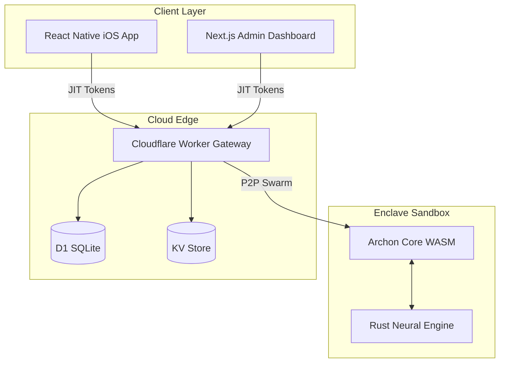

# Archon: Autonomous AI Life Twin

> Archon is an autonomous, on-device AI twin that acts on your behalf, paying for services using crypto-native FinOps, while keeping your private data strictly within a secure WASM enclave.


## System Architecture



## Running the Demo

For hackathon judges, please follow these steps to experience the complete Archon ecosystem locally:

### 1. Prerequisites
- Node.js 18+
- pnpm (`npm install -g pnpm`)
- Rust (`rustup default stable`)
- wrangler (`npm install -g wrangler`)

### 2. Setup the Cloud Edge (Gateway)
1. Navigate to the gateway app: `cd apps/gateway`
2. Install dependencies: `pnpm install`
3. Initialize the D1 database: 
   ```bash
   wrangler d1 execute archon-core-db --local --file=./migrations/0001_init.sql
   ```
4. Start the local worker:
   ```bash
   npm run dev
   ```
   *The gateway will be running on `http://localhost:8787`.*

### 3. Setup the Enterprise Web Dashboard
1. Open a new terminal and navigate to the web app: `cd apps/web`
2. Install dependencies: `pnpm install`
3. Start the Next.js frontend:
   ```bash
   pnpm run dev
   ```
4. Open your browser to `http://localhost:3000`. You will see the beautiful glassmorphism Archon Dashboard reflecting live metrics from the gateway.

### 4. Setup the Mobile App (Consumer Twin)
1. Open a third terminal and navigate to the mobile app: `cd apps/mobile`
2. Install dependencies: `pnpm install`
3. Start Expo:
   ```bash
   npx expo start
   ```
4. Press `i` to open in iOS Simulator (or use Expo Go on your physical device).
5. Swipe through the Onboarding Carousel and explore the 6 core action hubs!

## Key Features Demonstrated
- **State Persistence:** Rebuilt the `org_management.ts` to seamlessly use Cloudflare D1 instead of volatile in-memory Maps.
- **Secure Mock Auth:** Configured `GATEWAY_API_KEY` cross-app communication, removing dangerous hardcoded SSO tokens.
- **Premium UX:** Re-themed the Web Dashboard using `Space Grotesk` and deep glassmorphism for a modern "Encrypted Dark" aesthetic.
- **Cognitive Optimization:** Reduced the mobile app's 15-button grid to 6 core actions, preventing user fatigue.

## License
MIT
